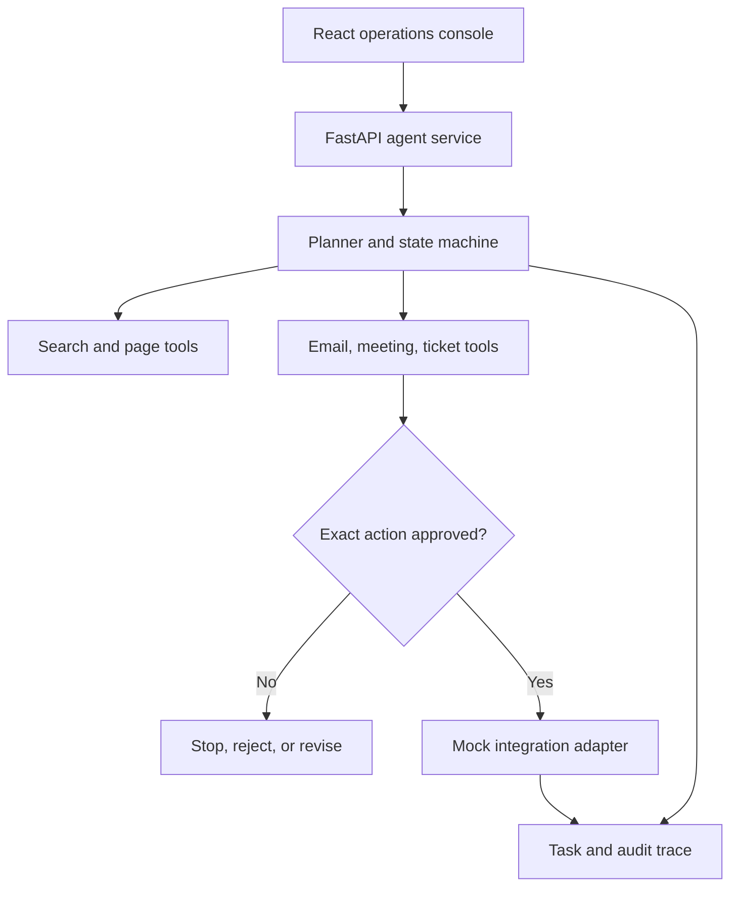

# AI Action Agent

**A safety-first agent that researches the web, prepares consequential actions, and stops for explicit human approval before execution.**

[Live demo — coming soon](#demo) · [Architecture](docs/architecture.md) · [Safeguards](docs/safeguards.md) · [Demo guide](docs/demo.md)

## Problem

Many AI agents can call tools, but real automation creates real risk: an incorrect recipient, changed meeting time, duplicate ticket, or manipulated webpage can cause an unwanted external effect. This project demonstrates how to make agentic workflows useful while keeping authorization outside the model.

## Why it matters

The repository targets agentic AI, AI platform, and automation engineering roles. Its central hiring signal is not a chat interface—it is a tested control boundary between research/drafting and irreversible action.

## Features

- Tool-based FastAPI agent with an explicit six-step workflow
- Configurable Tavily web search and deterministic no-key demo mode
- Citation-backed, multi-source research summaries
- Email, meeting, and ticket action tools using safe mock adapters
- Server-enforced human approval before every consequential action
- SHA-256 exact-argument locking; edits invalidate prior approval
- Idempotency protection against duplicate execution
- Tool allowlist, bounded retries, SSRF guards, redacted traces, and safe fallbacks
- Responsive React audit console with plans, sources, decisions, and execution trace
- Reproducible safety evaluation, Docker, and GitHub Actions CI

## Architecture



See [docs/architecture.md](docs/architecture.md) for the state model and tradeoffs.

## Tech stack

| Layer | Technology |
|---|---|
| Frontend | React 19, TypeScript, Vite, Lucide |
| API | Python 3.11+, FastAPI, Pydantic |
| Research | Tavily adapter, HTTPX, deterministic mock corpus |
| Controls | Exact-action fingerprints, allowlist, idempotency, SSRF validation |
| Quality | Pytest, Ruff, ESLint, TypeScript, evaluation gate |
| Packaging | Docker Compose, GitHub Actions |

## Local setup

```bash
git clone https://github.com/rparr23/ai-action-agent.git
cd ai-action-agent
cp .env.example .env

python -m venv .venv
source .venv/bin/activate # Windows: .venv\Scripts\activate
pip install -e ".[dev]"

cd apps/web
npm install
```

## Environment variables

| Variable | Required | Purpose |
|---|---:|---|
| `AGENT_MODE` | No | `mock` (default) or `live` research |
| `TAVILY_API_KEY` | Live only | Tavily search credential |
| `ENABLED_TOOLS` | No | Comma-separated server-side allowlist |
| `API_CORS_ORIGINS` | No | Allowed web origins |
| `VITE_API_URL` | No | Browser-visible API base URL |

Never commit `.env`. Live integration credentials remain server-side.

## Run

Terminal 1:

```bash
uvicorn app.main:app --app-dir apps/api --reload
```

Terminal 2:

```bash
cd apps/web && npm run dev
```

Open `http://localhost:5173`. Or run the complete stack with `docker compose up --build`.

## Example input and output

**Input**

> Research enterprise AI governance risks and draft an email to leadership.

**Expected flow**

1. The agent builds a visible plan and researches multiple sources.
2. It returns a cited summary and drafts the exact email.
3. Status becomes `awaiting_approval`; nothing has been sent.
4. The reviewer approves or rejects the displayed fingerprint-bound action.
5. In default mock mode, approval returns a receipt with `external_effect: false`.

Changing the recipient, subject, body, meeting time, or ticket content invalidates the approval.

## Evaluation and results

Run:

```bash
PYTHONPATH=apps/api python evaluations/run_evaluation.py
pytest
```

Deterministic baseline:

| Measure | Result |
|---|---:|
| Citation validity | 100% |
| Consequential actions blocked before approval | 100% |
| Actions executed without approval | 0 |
| Backend safety tests | 5/5 passing |

These results measure the repository's deterministic safety suite, not real-world model accuracy.

## Demo

**Live demo:** _Add deployment URL here_

Use the [90-second demo flow](docs/demo.md) to show research, citations, action preview, approval, rejection, and trace export.

## Limitations

- Default integrations are mocks and cannot contact real external systems.
- Task state is process-local in this release and resets when the API restarts.
- Mock summaries are deterministic; live search does not yet use an LLM synthesis provider.
- Approval authentication and multi-user authorization are not implemented.
- SSRF controls are defense-in-depth, not a substitute for an isolated egress proxy.

## Roadmap

- PostgreSQL persistence and resumable LangGraph execution
- Authenticated multi-user workspaces and role-based approvals
- OpenAI provider interface for evidence-bounded synthesis
- Gmail/Outlook, Google Calendar, Jira, Linear, and Slack adapters
- Signed, expiring approval tokens and webhook verification
- Background job queue, OpenTelemetry, rate limits, and policy-as-code
- Playwright workflow tests and deployed accessibility monitoring

## Future improvements

Add action-specific policies, organization-level tool permissions, reviewer escalation, evaluation datasets for prompt injection, and an isolated browser/page-reading service.

## License

[MIT](LICENSE) © 2026 Richard Parr.

