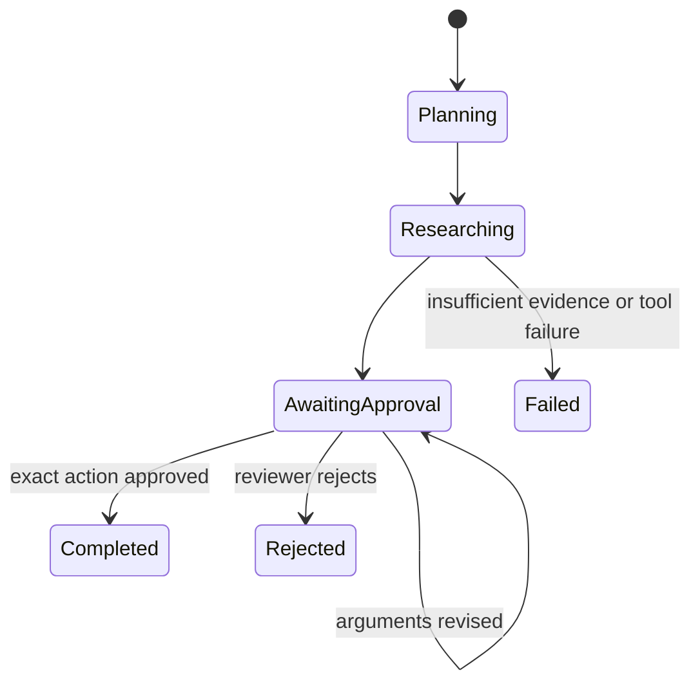

# Architecture

The system separates probabilistic planning from deterministic authorization. The agent may propose an action, but only API code can transition it across the approval boundary.

Each proposal is canonicalized and SHA-256 hashed. The API recomputes this fingerprint at approval time, compares it with the reviewer's submitted value, checks the tool allowlist, and atomically claims the idempotency key before calling an adapter.

Current task persistence is an in-process, lock-protected store so the project stays easy to run. The production migration path is PostgreSQL with transactions around approval claims and outbox-based integration delivery.

